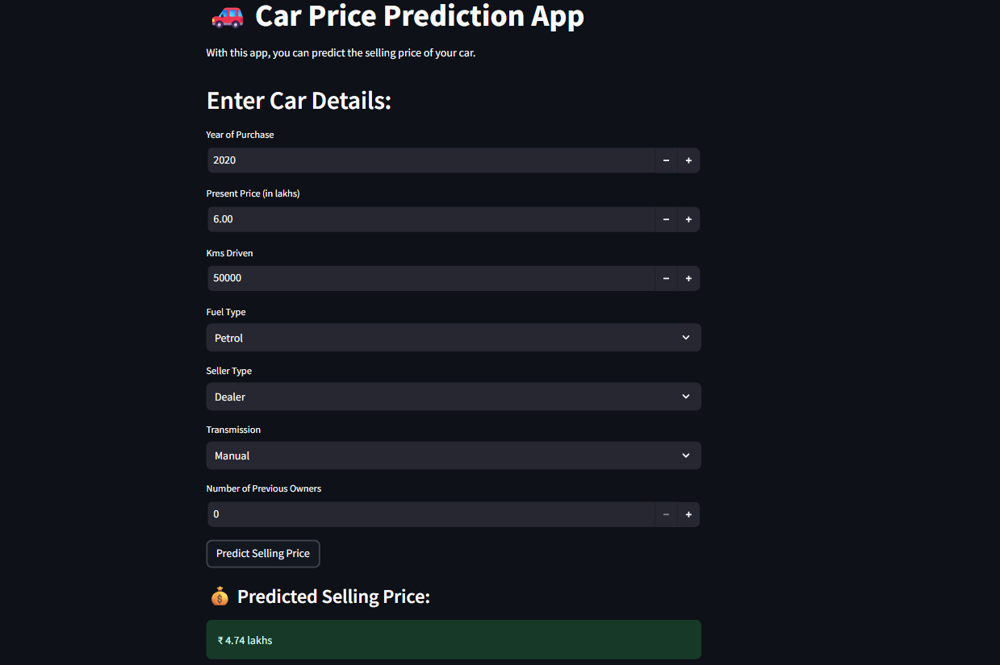

# 🚗 Car Price Prediction Web App

This project is a **Machine Learning Web App** that predicts the **selling price of cars**.  
The app is built using **Streamlit** and trained on the **CarDekho dataset**.  

---

## 📂 Project Files

| File Name          | Description |
|--------------------|-------------|
| `Car.ipynb`        | Jupyter Notebook for data preprocessing, model training, and evaluation. |
| `cardekho_data.csv`| Dataset (CarDekho cars data) containing car features and target price. |
| `model.pkl`        | Trained ML model (pickle file) used for prediction. |
| `ui.py`            | Streamlit app that takes user input and predicts the car selling price using the trained model. |

---

## ⚙️ Installation & Setup

1. **Clone the Repository**
   ```bash
   git clone https://github.com/SUJAYBARAI/Car_price_Prediction.git
   cd Car_price_Prediction
   ```

2. **Install Requirements**
   ```bash
   pip install -r requirements.txt
   ```

3. **Run the Streamlit App**
   ```bash
   streamlit run ui.py
   ```

---

## 📊 Dataset

The dataset used for training is included in this repository:  
[Download `cardekho_data.csv`](https://github.com/SUJAYBARAI/Car_price_Prediction/blob/main/cardekho_data.csv)

---

## 🛠 Features
- User-friendly web app for car price prediction  
- Inputs:
  - Year of Purchase  
  - Present Price (in lakhs ₹)  
  - Kms Driven  
  - Fuel Type (Petrol/Diesel/CNG)  
  - Seller Type (Dealer/Individual)  
  - Transmission (Manual/Automatic)  
  - Number of Previous Owners  
- Output: **Predicted Selling Price (in lakhs)**  

---

## ✨ Tech Stack
- Python  
- Pandas, NumPy  
- Scikit-learn  
- Streamlit  

---

## 📸 Demo
screenshot or GIF here_  




## 🌍 Live Demo
You can try the app here: [Car Price Prediction App](https://carpriceprediction-t32eeouu4jwftqgvy8w7bp.streamlit.app/)


---

## 📜 License
This project is licensed under the [MIT License](./LICENSE).  

---

## 🙌 Acknowledgement
- Dataset Source: [CarDekho](https://www.cardekho.com)  
